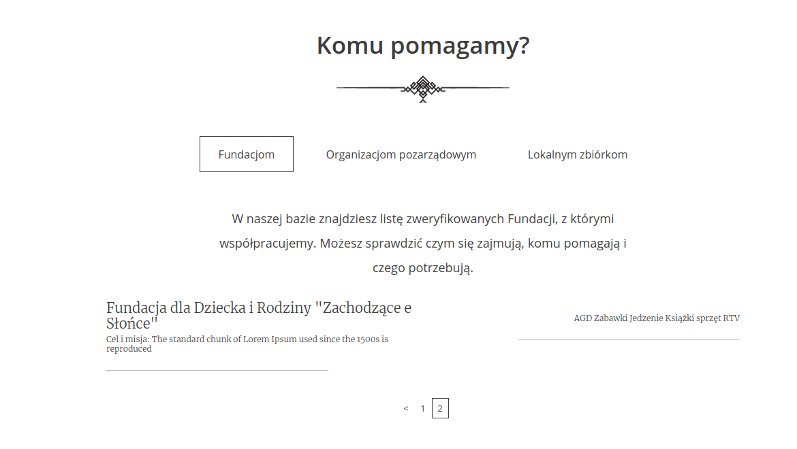
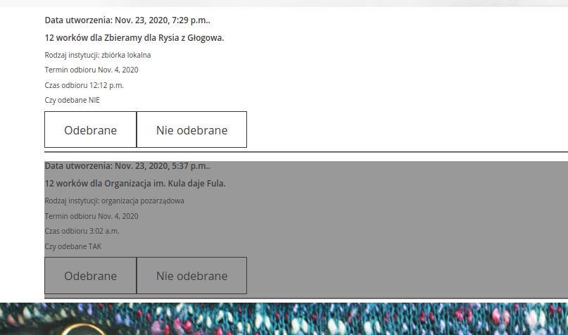
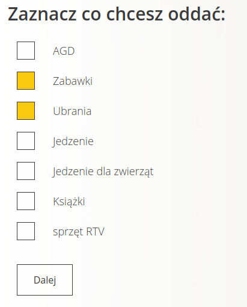
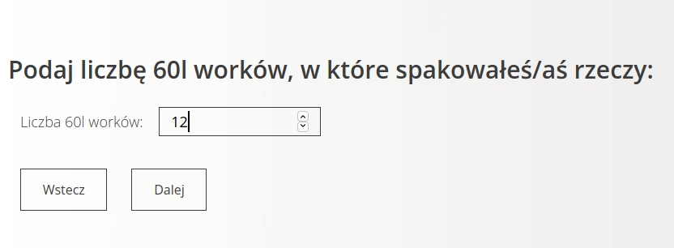
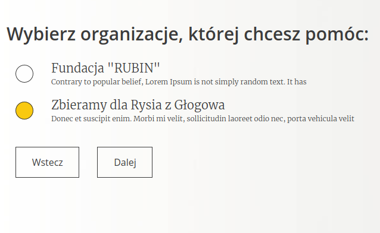
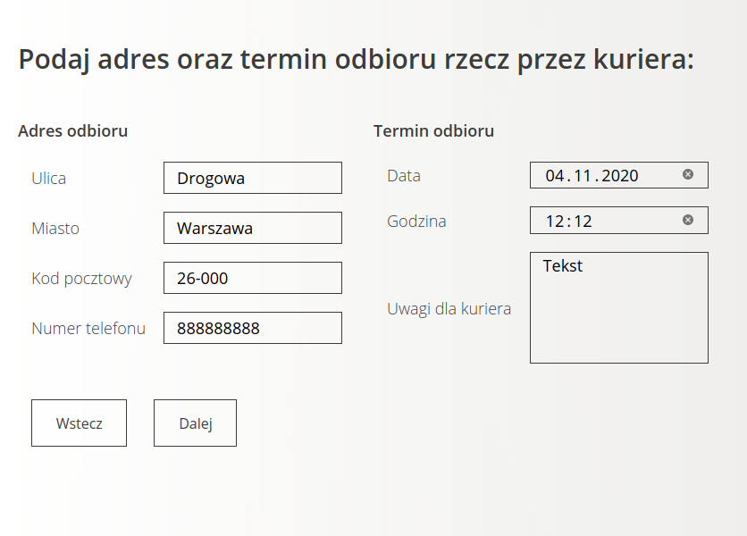
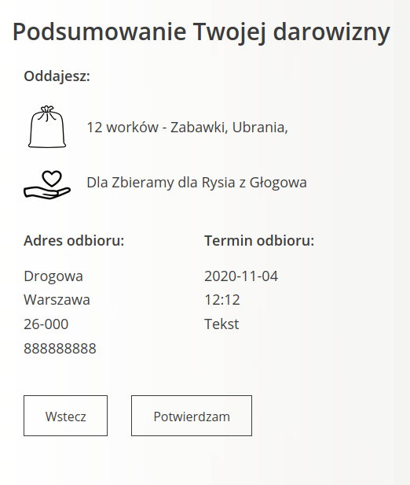
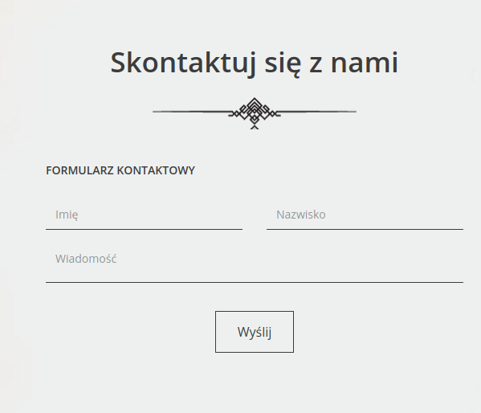

# good_hands
Hi, this is my third website. Django,JS, Python, PostgreSQL

It's deploy on Heroku server https://goodhands123.herokuapp.com/
Functionalities (below you can find screens from page)

1. Login and CRUD user
2. Account activation via Email
3. Donation form with JS.
4. Pagination
5. Donations lists
6. Password restart via E-mail 
and more :)

